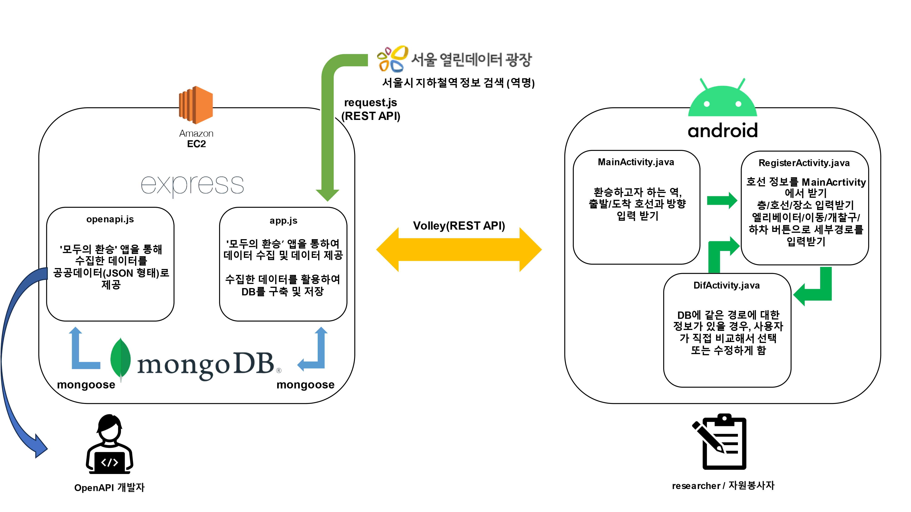

# 모두의 환승
## 소개
교통약자들의 이동권에 대한 사회적 논의는 최근까지 계속해서 이어지고 있습니다. 장애인의 관점으로 지하철역을 돌아다녀 보니 승강기나 리프트의 위치가 잘 표시되어 있지 않아 찾으러 다니는 데에 많은 시간이 들어갑니다.<br>
또이오티 팀은 이러한 문제에 초점을 두어 장애인의 지하철 환승에 대해 찾아보았고 그 결과 협동조합 '무의'에서 실제로 장애인들을 위한 환승 지도를 제작하고 있지만 데이터를 수집하는 과정에서 많은 어려움을 겪고 있다는 사실을 알게 되었습니다.<br>
그래서 환승 정보 데이터를 정형화해서 받아옴으로써 지도를 만드는 데 드는 시간을 단축하고 데이터 관리를 유용하게 할 수 있게 하도록 하기 위해 '모두의 환승' 애플리케이션을 만들게 되었습니다.<br>
앱을 사용해 데이터를 정형화해서 수집하고, 수집한 데이터를 정리해서 제공할 수 있는 API 제작하는 것을 최종 목표로 합니다. 이 앱을 리서처들에게 제공함으로써 모두 같은 방식으로 데이터를 모으도록 하여 모인 데이터들을 정리하고 활용하는 데 드는 시간과 노동력을 최소화할 수 있을 것으로 기대됩니다.<br><br>


<br><br>

<!-- ## 시연 영상
[](https://youtu.be/cYq_--GPmiE)
<br><br> -->

## System Architecture

<br><br>

## 개발환경 및 개발언어

<br><br>

## 제공되는 Open API
`서울특별시 교통약자 지하철 환승지도 openAPI`의 reference는 <a href="http://3.39.25.196:3000/api-docs/#/">Swagger UI</a>에서 확인할 수 있으며, **3.39.25.196:3000**으로 openAPI가 배포되어 있습니다..
<br><br>


## 앱을 설치하는 방법
"**모두의 환승**"은 교통약자 환승 지도를 제작하는 전문 리서처에게 제공할 목적으로 만들어진 어플리케이션으로, 데이터 처리가 용이하도록 사용자에게 많은 권한이 부여되어 있습니다. 따라서 구글 플레이 스토어 등을 통해서 불특정 다수에게 공개될 경우 환승 경로 데이터를 데이터베이스에 삽입하는 과정에서 잘못된 데이터가 등록될 우려가 있습니다. 따라서 다음과 같은 방식을 통하여 "모두의 환승"을 설치해야 합니다.
1. 안드로이드 5.0 버전 이상의 스마트폰을 준비한다.
2. 해당 repository의 release에서 zip 파일을 스마트폰에 다운로드합니다.
3. 관리자(yunminwo1211@gmail.com)에게 메일을 통해 문의하여, zip 파일의 암호를 제공 받습니다.
4. zip파일 내부의 apk 파일을 실행하여 앱을 설치해 사용합니다.
<br><br>

## 이 프로젝트에 기여하는 방법
이 프로젝트에 기여하고 한다면, <a href="https://github.com/AgainIoT/Everyones-Transfer_Main/wiki/To-Contribute-this-Project...">GitHub Wiki</a>를 참고하여 해당 프로젝트에 기여해주시면 됩니다.
<br><br>

## 초기 설정
아래의 코드를 입력하여 업데이트 및 초기 설정(submodule 불러오기)를 진행할 수 있습니다.

```bash
bash update.sh
```
<br>

### 팀 정보
| Name   | Email                 | Part | Tech Stack |
| ------ | --------------------- | ---------- | ---------- |
| <a href="https://github.com/ymw0407">윤민우</a> | yunminwo1211@gmail.com | Backend  | Express.js, MongoDB |
| <a href="https://github.com/jjunh33">이준혁</a> | jjunh33@naver.com | Backend | Express.js, MongoDB |
| <a href="https://github.com/bentshrimp">박진우</a> | bentshrimp@gmail.com | Frontend | Java(Android OS), XML |
| <a href="https://github.com/hummingbbird">이채영</a> | pop98149814@gmail.com | Frontend | Java(Android OS), XML |
| <a href="https://github.com/Kim-Jiyun">김지윤</a> | kwldbs1118@gmail.com | Frontend | Java(Android OS), XML |
