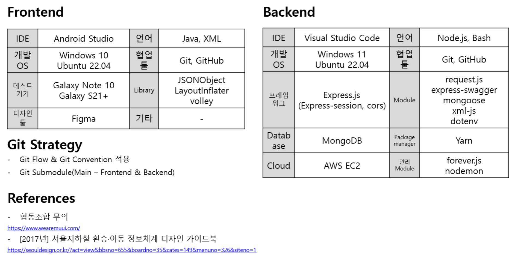

# 모두의 환승
교통약자들의 이동권에 대한 사회적 논의는 최근까지 계속해서 이어지고 있다. 많은 사람의 노력으로 이동권 개선이 이루어지고 있지만 비장애인에 비교하면 장애인의 이동권 보장은 턱없이 부족하다.​ <br>
실제로 장애인의 관점으로 지하철역을 돌아다녀 보니 승강기나 리프트의 위치가 잘 표시되어 있지 않아 찾으러 다니는 데에 많은 시간이 들었다.​ <br>
우리는 이러한 문제에 초점을 두어 장애인의 지하철 환승에 대해 찾아보았고 그 결과 협동조합 '무의'에서 실제로 장애인들을 위한 환승 지도를 제작하고 있지만 데이터를 수집하는 과정에서 많은 어려움을 겪고 있다는 사실을 알게 되었다.​ <br>
우리는 환승 정보 데이터를 정형화해서 받아옴으로써 지도를 만드는 데 드는 시간을 단축하고 데이터 관리를 유용하게 할 수 있게 하도록 하기 위해 '**모두의 환승**' 애플리케이션을 만들게 되었다.​<br><br>


## 문제 인식 및 요구사항 분석
교통 약자들의 이동권에 대한 사회적 논의는 최근까지 계속해서 이어지고 있고, 이러한 부분 의문점을 갖게 되어 직접 교통 약자들의 시선으로 지하철역을 돌아다녀 보았다. 하지만, 역사에서 제공하는 지도와 실제는 차이가 있으며, 그 차이로 인해 많은 교통 약자들이 이동권을 보장받지 못한다는 문제를 인식하게 되었다.​<br>
그렇게 이와 관련되어 서울 지하철 교통약자 환승 지도를 만드는 등의 활동을 진행하고 있는 협동조합 무의와 컨택하게 되었고, 이에 대해 교통약자 분들의 의견과, 환승 지도를 만드는 분들이 느끼는 어려운 점을 듣게 되었다. ​​<br>
협동조합 무의 측과의 소통을 통해서 이전까지는 데이터를 리서처분들이 직접 수기로 조사하고, 이후에 디자이너들이 조사한 자료들을 토대로 오른쪽의 그림과 같은 데이터를 직접 만들기 때문에, 정확도와 최신화 속도 부분에서 많은 어려움이 있다는 것을 알 수 있었다. 그런 부분을 해결하기 위해 리서처분들이 앱을 통해 제공되는 표준화 데이터를 데이터베이스 저장하고, 표준화 데이터를 제공하는 앱을 만들기로 하였다.​


<br><br>

## System Architecture

<br><br>

## 개발 환경 및 참고 문헌

<br><br>

## 초기 설정
아래의 코드를 입력하여 업데이트 및 초기 설정을 진행할 수 있다.

```bash
bash update.sh
```